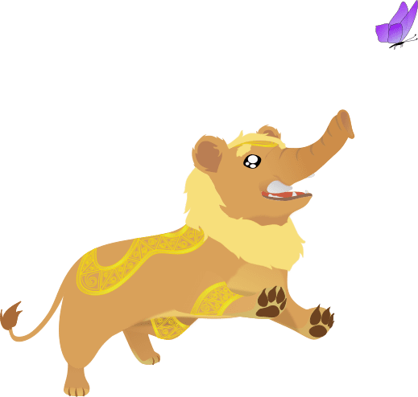
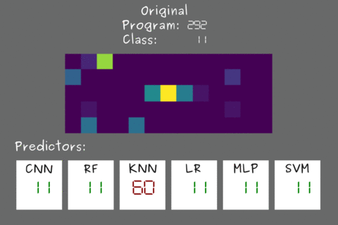

<h1 align="center" style=""> Yali </h1>

<p align="center">
  
</p>

<p align="center">
  <a href="https://github.com/thais-damasio/yali/blob/main/LICENSE"></a>
  <a href="https://github.com/lac-dcc/yali/commits/main">
    
  </a>
</p>


## :pushpin: **Contents Table**

* [Introduction](#introduction)
* [Getting Started](#getting-started)
    * [Prerequisites](#prerequisites)
    * [Setup](#setup)
    * [Running](#running)
* [Statistics](#statistics)
* [Structure](#structure)
* [To Do](#to-do)


---
<a id="introduction"></a>

## :scroll: **Introduction**

Let _D_ be a deep learning model that classifies programs according to the problem they solve. This project aims to evaluate how _D_ behaves with obfuscated code. We want to know how much the accuracy of _D_ is affected.

<p align="center">

</p>

> The top of the image above shows the histogram produced by a specific strategy for program *292*. This program belongs to class 11 of the *POJ-104 dataset*. The bottom of the image shows how each model classifies the variations of program *292*.

---
<a id="getting-started"></a>

## :checkered_flag: **Getting Started**
In this section are the steps to reproduce our experiments.


<a id="prerequisites"></a>

### **Prerequsites**
You need to install the following packages to run this project:

* [Docker](https://www.docker.com/get-started/) and [Docker Compose](https://docs.docker.com/compose/install/) to run our experiments
* [Python-3](https://www.python.org/downloads/) to plot the results in the project's Jupyter Notebook
* [Wget](https://www.gnu.org/software/wget/), [Tar](https://www.gnu.org/software/tar/) and [Sed](https://www.gnu.org/software/sed/) to run the initial scripts to configure the repository and 


<a id="setup"></a>

###  **Setup**

First, you should copy the `.env.example` file and rename it to `.env`.
You can now set environment variables in the `.env` file at the project's root. You can change the following variables:

<table>
    <tbody>
        <tr>
            <th>Variable</th>
            <th>Description</th>
            <th>Value</th>
        </tr>
        <tr>
            <td>MODEL</td>
            <td>Selected machine learning model. This variable is required.</td>
            <td>
                <ul>
                    <li>"lstm" (Long Short-Term Memory) </li>
                    <li>"cnn" (Convolutional Neural Network by <a href="https://dl.acm.org/doi/10.5555/3015812.3016002">Lili Mou et al.</a>)</li>
                    <li>"rf" (Random Forest) </li>
                    <li>"svm" (Support Vector Machine) </li>
                    <li>"knn" (K-Nearest Neighbors) </li>
                    <li>"lr" (Logistic Regression) </li>
                    <li>"mlp" (Multilayer Perceptron) </li>
                </ul>
            </td>
        </tr>
        <tr>
            <td>TRAINDATASET / TESTDATASET</td>
            <td>Dataset that will be used in the training/testing phase. TRAINDATASET is required, but <b>TESTDATASET must be empty if you want to use the same dataset in training and testing phase.</b></td>
            <td>
                <ul>
                    <li>
                        "OJClone" (POJ-104 dataset used by <a href="https://dl.acm.org/doi/10.5555/3015812.3016002">Lili Mou et al.</a>)
                    </li>
                    <li>
                        "BCF" (The OJClone dataset that was obfuscated by the <a href="https://github.com/obfuscator-llvm/obfuscator/wiki/Bogus-Control-Flow">Bogus Control Flow</a> strategy) 
                    </li>
                    <li>
                        "FLA" (The OJClone dataset that was obfuscated by the <a href="https://github.com/obfuscator-llvm/obfuscator/wiki/Control-Flow-Flattening">Control Flow Flattening</a> strategy)
                    </li>
                    <li>
                        "SUB" (The OJClone dataset was obfuscated by the <a href="https://github.com/obfuscator-llvm/obfuscator/wiki/Instructions-Substitution">Instructions Substitution</a> strategy)
                    </li>
                    <li>
                        "OLLVM" (The OJClone dataset that was obfuscated by the <a href="https://github.com/obfuscator-llvm/obfuscator/wiki/Control-Flow-Flattening">Control Flow Flattening</a>, <a href="https://github.com/obfuscator-llvm/obfuscator/wiki/Bogus-Control-Flow">Bogus Control Flow Strategy</a> and <a href="https://github.com/obfuscator-llvm/obfuscator/wiki/Instructions-Substitution">Instructions Substitution</a> strategies, respectively)
                    </li>
                    <li>
                        "MCMC" (The OJClone dataset that was obfuscated by the <a href="https://arxiv.org/pdf/2111.10793.pdf">Markov Chain Monte Carlo</a> strategy)
                    </li>
                    <li>
                        "DRLSG" (The OJClone dataset that was obfuscated by the <a href="https://arxiv.org/pdf/2111.10793.pdf">Deep Reinforcement Learning Sequence Generation</a> strategy)
                    </li>
                    <li>
                        "RS" (The OJClone dataset that was obfuscated by the <a href="https://arxiv.org/pdf/2111.10793.pdf">Random-Search</a> strategy)
                    </li>
                </ul>
            </td>
        </tr>
        <tr>
            <td>OPTLEVELTRAIN / OPTLEVELTEST</td>
            <td>Optimization level applied in the traning/testing dataset. OPTLEVELTRAIN is required, but <b>OPTLEVELTEST must be empty if TESTDATASET is empty.</b></td>
            <td>
                <ul>
                    <li>O0</li>
                    <li>O3</li>
                </ul>
            </td>
        </tr>
        <tr>
            <td>NUMCLASSES</td>
            <td>The number of classes of the dataset. This variable is required.</td>
            <td></td>
        </tr>
        <tr>
            <td>ROUNDS</td>
            <td>The number of rounds to run the model. This variable is required.</td>
            <td></td>
        </tr>
        <tr>
            <td>MEMORYPROF</td>
            <td>Indicate whether a memory profiler will be used. This variable is required.</td>
            <td>
                <ul>
                    <li>yes</li>
                    <li>no</li>
                </ul>
            </td>
        </tr>
    </tbody>
</table>


After that, you need to prepare the environment to run our experiments. Run the following command line:

```bash
$ ./setup.sh
```
> This will download the datasets, build the docker image and create the necessary folders for the project. 


<a id="running"></a>

### **Running**
Now, you can run the following command line:

```bash
$ ./run.sh MODE
```
There are the following values for `MODE`:
* **all**: Run all games and the resources analysis
* **resources**: Run only the resources analysis
* **game0** Run the [Game 0]() (*We will put the link later*)
* **game1**: Run the [Game 1]() (*We will put the link later*)
* **game2**: Run the [Game 2]() (*We will put the link later*)
* **game3**: Run the [Game 3]() (*We will put the link later*)

> This will run the docker container with the configurations in the `.env` file.


---
<a id="statistics"></a>

## :bar_chart: **Statistics**
The `Statistics` folder contains _Jupyter Notebooks_ that plot the data generated by the experiments. Each notebook describes each chart and the steps to develop them. There are the following _notebooks_:

* [**GameResults**](./Statistics/GameResults.ipynb): Presents information about the 4 games proposed in our [work]() (*We will put the link later*).
* [**ResourceResults**](./Statistics/ResourceResults.ipynb): Presents information about resource consumption (memory and time) of each model
* [**StrategiesResults**](./Statistics/StrategiesResults.ipynb): Presents the distance between the histograms of the original programs and the histograms generated by the obfuscators 


---
<a id="structure"></a>

## :card_index_dividers: Structure
The repository has the following organization:

```bash
|-- Classification: "scripts for the classification process"
|-- Compilation: "scripts for the compilation process"
|-- Docs: "Repository documentation"
|-- Entrypoint: "container setup"
|-- Extraction: "scripts to convert CSV to Numpy"
|-- HistogramPass: "LLVM pass to get the histograms"
|-- Statistics: "jupyter notebooks"
|-- Volume: "volume of the container"
    |-- Csv: "CSVs with the histograms"
    |-- Histograms: "histograms in the Numpy format"
    |-- Irs: "LLVM IRs of the programs"
    |-- Results: "results of the training/testing phase"
    |-- Source: "source code of the programs"
```


---
<a id="next-steps"></a>

## To Do

We are going to do the following to increment our repository:

- [ ] Put the paper link in this ReadME
- [ ] Add the experiment that compares different embeddings